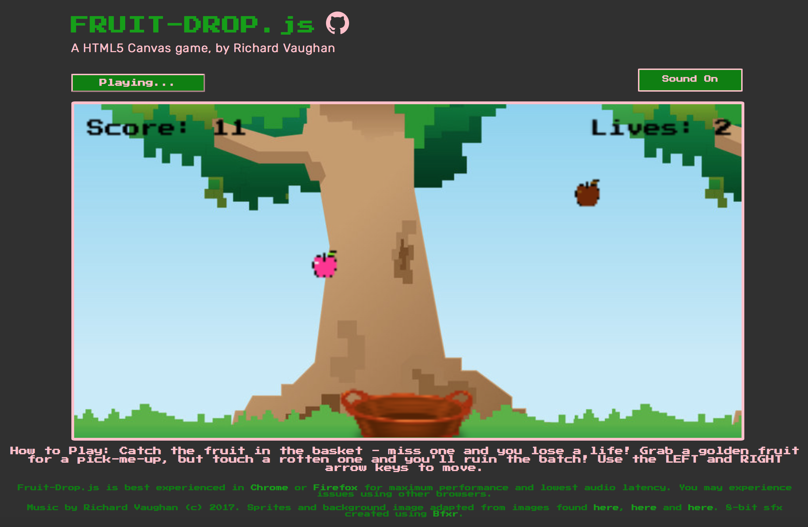

## Fruit-Drop.js 🍎

Fruit-Drop.js is my first attempt at writing a browser-based game, using Javascript and a HTML5 Canvas.

## How to Play

You can play Fruit-Drop.js <a href="http://www.richvaughan.co.uk/pages/fruit-drop/fruit-drop.html">here</a>.

It's recommended to play either in Chrome or Firefox. Otherwise, you can download the source code and run it off your machine for best performance. 👊

## To Add in Future Versions
* DataLayer pushes for analytics (game completions, custom dimensions for scores, etc)
* Improve cross-compatibility between browsers - fixing audio latency and performance issues.
* Tweak object spawning positions, spawning frequency and acceleration for improved gameplay.
* Refine and optimise game update alogrithm - remove repeated code and pack up into functions for tidiness/readability.
* Improve collision detection (remove hardcoded player width modifier values etc).
* Add a function that saves and displays your high score.
* Animated sprites (basket filling up, an animated health bar, 'splat' effects, etc).
* Introduce powerups? (bigger paddle, change speed, x2 score etc for limited time).
* Add button to share score and game link to fb.
* Possibly add touch capability (or port to iOS app).
* Any necessary bug fixes

## Note:
* The code here references the cookie consent management script found in [this](https://github.com/vaughan-rich/vaughan-records) repo.
